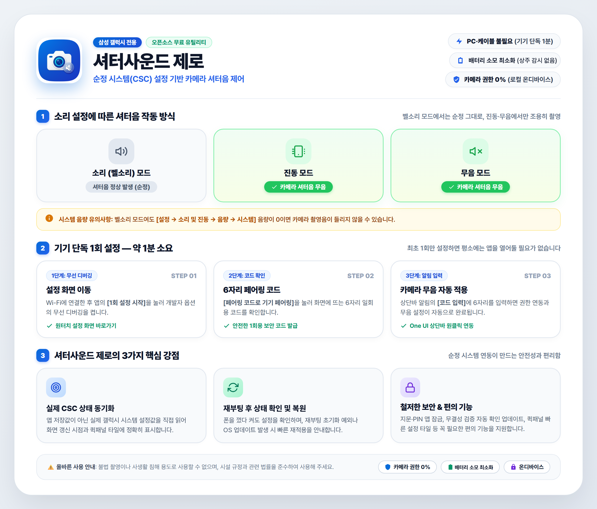

# 셔터음 제로 (Shutter Sound Zero)

> 삼성 갤럭시폰을 위한 카메라 셔터음 설정 도구

[](LICENSE)
[](https://developer.android.com)
[](https://www.samsung.com)
[](https://github.com/hoons1994/ShutterSoundZero/releases/latest)

<div align="center">
  
</div>

---

## 📖 소개

**셔터음 제로(Shutter Sound Zero)**는 도서관, 독서실, 세미나실, 강의실 등 정숙이 필요한 장소나 잠든 영유아 및 반려동물을 촬영할 때 주변에 소음으로 인한 불편을 주지 않도록 돕는 간단한 안드로이드 오픈소스 유틸리티입니다.

화면을 실시간 감시하는 기존 무음 앱의 '접근성 권한' 대신, 삼성 갤럭시폰의 **순정 시스템(CSC) 설정값**을 활용하여 배터리와 성능에 아무런 부담을 주지 않고 깔끔하게 무음화를 지원합니다.

---

## 📱 다운로드

* **최신 릴리즈 APK 다운로드**: [GitHub Releases 최신 버전 받기](https://github.com/hoons1994/ShutterSoundZero/releases/latest)
* 지원 기종: 삼성 갤럭시폰 (Android 11 이상)

---

## ✨ 주요 특징

1. **🔋 백그라운드 배터리 소모 0%**
   * 화면을 백그라운드에서 실시간 감시하는 상주 서비스를 일절 사용하지 않습니다.
   * 안드로이드 시스템 설정값만 1회 조정하므로 배터리 및 메모리 소모가 없습니다.
2. **📲 PC 및 외부 앱 없는 기기 단독 1회 설정**
   * 컴퓨터나 USB 케이블 연결, 외부 Shizuku 설치가 필요 없습니다.
   * 기기 자체 설정의 [무선 디버깅] 화면에서 **스마트폰 상단바를 내려 6자리 코드만 1회 입력**하면 연동이 완료됩니다.
3. **🔔 벨소리 / 진동 모드 자동 연계**
   * 카메라 소리를 무조건 없애는 것이 아닙니다.
   * **벨소리 모드에서는 기존처럼 정상적으로 찰칵 소리가 나며, 스마트폰을 진동 또는 무음 모드로 전환했을 때만 셔터음이 나지 않습니다.**
4. **🎛️ 상단 빠른 설정(Quick Settings) 타일 지원**
   * 앱을 열지 않고도 상단 알림창 퀵 패널에서 원터치로 무음 모드를 켜고 끌 수 있습니다.
5. **🔄 재부팅 및 펌웨어 업데이트 감지 & 자동 복원**
   * 스마트폰이 꺼졌다 켜져도 무음 상태를 유지하며, OS 업데이트로 설정이 초기화되더라도 백그라운드에서 감지하여 자동 복원합니다.

---

## 🚀 처음 1회 설정 방법 (약 1분 소요)

```
[1단계: 권한 요청]
  ➔ Wi-Fi 연결 상태에서 앱 메인 화면의 [권한 요청] 버튼을 터치합니다.
  ➔ 스마트폰이 알아서 설정의 [무선 디버깅] 화면으로 바로 이동합니다.

[2단계: 페어링 코드 확인]
  ➔ [무선 디버깅] 스위치를 켠 뒤 [페어링 코드로 기기 페어링]을 누릅니다.
  ➔ 화면에 6자리 일회용 숫자 코드가 표시됩니다.

[3단계: 상단바 알림에 입력]
  ➔ 화면을 닫지 않고 스마트폰 상단바를 내려 떠 있는 알림에 6자리 코드를 입력하고 [전송]을 누릅니다.
  ➔ 무음 연동이 완료됩니다! ✨
```

> **💡 팁**: 연동이 끝나면 **[무선 디버깅] 스위치는 바로 꺼두셔도 됩니다.** 이미 적용된 카메라 무음 상태는 평소 무선 디버깅을 꺼두셔도 영구히 유지됩니다.

---

## 🛡️ 안전성 및 보안 보장

* **100% On-Device 로컬 통신**: 외부 인터넷 서버와의 통신 트래픽이 0건(Zero Outbound)이며, 광고나 분석 트래픽이 일절 없습니다.
* **카메라 권한 없음**: 본 앱은 카메라 접근 권한(`android.permission.CAMERA`) 자체가 없습니다. 사진이나 렌즈를 보지 않고 순정 오디오 설정값만 변경합니다.
* **독립 암호화 키**: 무선 디버깅에 사용되는 암호화 키(RSA 2048비트)는 각 기기 내부 샌드박스 스토리지에서 고유하게 생성됩니다.

---

## ⚖️ 올바른 사용 안내 및 법적 고지

* 본 프로그램은 도서관, 독서실, 세미나실, 학술 촬영, 수면 중인 영유아나 반려동물 촬영 등 **정숙이 필요한 합법적인 상황에서 주변 소음 피해를 방지하기 위한 목적**으로 제작되었습니다.
* 타인의 동의 없는 불법 촬영 등 관련 법률을 위반하는 모든 악용 행위는 엄격히 금지되며, 촬영으로 인해 발생하는 모든 법적 책임은 사용자 본인에게 있습니다.
* ※ 본 프로젝트는 개인이 제작한 독립 서드파티 오픈소스 소프트웨어이며, 삼성전자(Samsung Electronics)와 공식적인 관련이 없습니다.

---

## 📄 라이선스 (License)

본 프로젝트는 **[GNU General Public License v3.0 (GPL-3.0)](LICENSE)** 라이선스에 따라 배포됩니다.

```
Shutter Sound Zero (셔터음 제로)
Copyright (C) 2026 charmingcolor

This program is free software: you can redistribute it and/or modify
it under the terms of the GNU General Public License as published by
the Free Software Foundation, either version 3 of the License, or
(at your option) any later version.

This program is distributed in the hope that it will be useful,
but WITHOUT ANY WARRANTY; without even the implied warranty of
MERCHANTABILITY or FITNESS FOR A PARTICULAR PURPOSE.  See the
GNU General Public License for more details.
```
