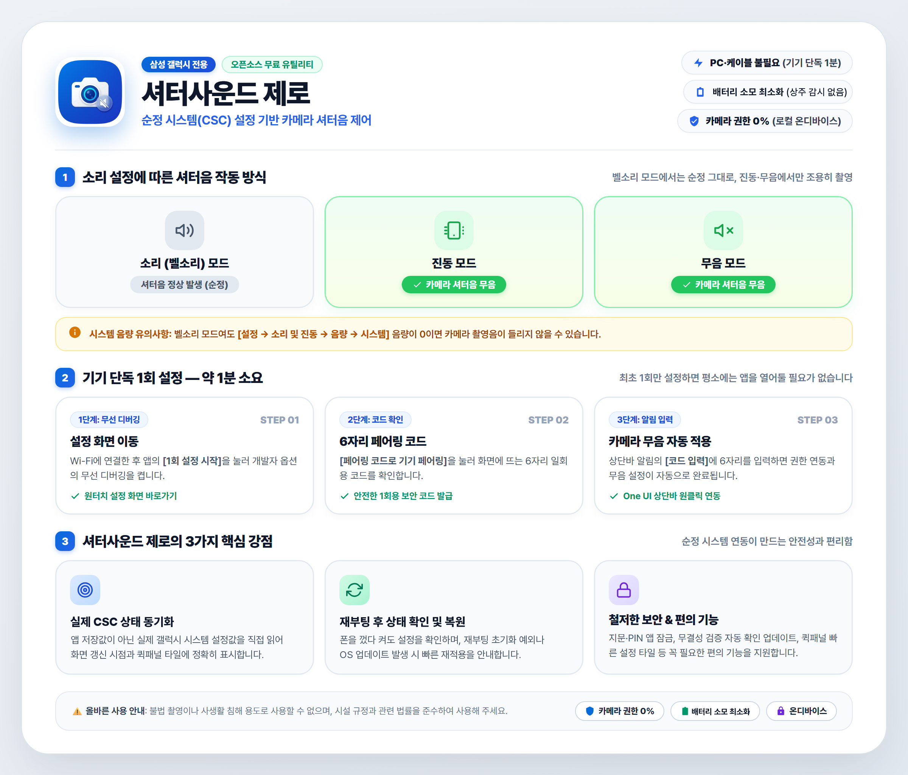

# 셔터사운드 제로 (Shutter Sound Zero)

> 삼성 갤럭시폰을 위한 카메라 셔터음 설정 도구

[](LICENSE)
[](https://developer.android.com)
[](https://www.samsung.com)
[](https://github.com/hoons1994/ShutterSoundZero/releases/latest)

<div align="center">
  
</div>

---

## 📖 소개

셔터사운드 제로(Shutter Sound Zero)는 삼성 갤럭시의 순정 시스템(CSC) 설정을 이용해 카메라 셔터음 동작을 관리하는 오픈소스 안드로이드 앱입니다.

접근성 서비스를 이용해 화면이나 카메라 실행을 상시 감시하지 않습니다. 최초 1회 로컬 무선 ADB로 `WRITE_SECURE_SETTINGS` 권한을 연동한 뒤, 필요할 때만 무선 디버깅을 켜서 실제 CSC 값을 변경합니다.

현재 앱 버전은 **v1.5.11**입니다. 앱 잠금의 시스템 인증을 Android Keystore 서명으로 검증하고, 무선 디버깅 상태에 맞춰 페어링 알림과 안내 창을 갱신합니다. 의존성·보안 검사와 배포 전 검증도 강화했습니다. 자세한 변경 사항은 [v1.5.11 릴리즈 노트](.github/release-notes/v1.5.11.md)를 확인해 주세요.

## 📱 다운로드

- 최신 APK: [GitHub Releases](https://github.com/hoons1994/ShutterSoundZero/releases/latest)
- 지원 환경: 삼성 갤럭시 / Android 11 이상
- v1.5.4 이상에서 업데이트: 같은 패키지 ID와 서명키를 사용하는 정식 APK는 기존 앱 위에 설치할 수 있습니다. v1.5.5 배포는 철회되었습니다.
- v1.5.3 이하에서 전환: v1.5.4부터 새 패키지 ID와 새 서명키를 사용하므로 기존 앱 위에 설치할 수 없습니다. 기존 앱을 삭제한 뒤 최신 버전을 새로 설치하고 1회 설정을 다시 진행해 주세요.

## ✨ 주요 기능

- 상태 중심 홈 — `카메라 무음 설정 완료`, `카메라 무음 다시 적용 필요`, `처음 한 번만 설정해 주세요`처럼 지금 상태와 필요한 다음 동작을 먼저 보여줍니다.
- 기기 단독 1회 설정 — PC, USB 케이블, 외부 Shizuku 앱 없이 무선 디버깅의 6자리 페어링 코드로 권한 연동과 초기 설정을 진행합니다.
- 단계별 설정 안내 — 홈에서 `① 개발자 옵션 켜기 → ② 무선 디버깅 켜기 → ③ 6자리 코드 입력 → ④ 카메라 무음 적용` 순서로 진행하며, 실패한 단계가 있으면 해당 위치에 재시도 안내를 표시합니다.
- 편한 코드 입력 알림 — 페어링 알림에서는 내부 포트나 권한 용어 대신 현재 필요한 행동만 안내합니다. One UI에서 간략한 팝업을 사용한다면 1회 설정 화면의 [알림 팝업 설정 열기]로 ShutterSoundZero만 자세한 팝업으로 바꿀 수 있습니다.
- 벨소리 모드 연계 — 벨소리 모드에서는 기존 셔터음이 유지되고, 진동·무음 모드에서는 CSC 설정에 따라 셔터음이 나지 않도록 동작합니다. 단, 벨소리 모드여도 설정 → 소리 및 진동 → 음량 → 시스템 음량이 0이면 촬영음이 들리지 않을 수 있습니다.
- 홈 화면 시스템 음량 조절 — 소리 모드에서 현재 시스템 음량을 확인하고 슬라이더로 조절할 수 있습니다. 변경 후 실제 적용값을 확인하며, 휴대전화 설정에서 바꾼 음량과 소리 모드도 홈에 반영합니다. 진동·무음 모드에서는 시스템 소리가 음소거되므로 소리 모드로 전환하도록 안내합니다. 방해 금지나 기기 정책으로 변경이 제한되면 [휴대전화 음량 설정]에서 직접 확인할 수 있습니다. 셔터음 외의 시스템 소리에도 적용되며 CSC 설정과는 별개입니다.
- 실제 CSC 상태 확인 — `csc_pref_camera_forced_shuttersound_key`의 실제 값을 읽어 화면 상태를 표시합니다. 설정 변경 후에도 실제 값이 적용됐는지 확인합니다.
- 빠른 설정 타일 — Quick Settings 타일에서 상태를 확인하고 카메라 무음 적용·복원을 실행할 수 있습니다. 변경하려면 무선 디버깅을 켜야 하며, 앱 잠금 사용 시 타일에서도 본인 인증이 필요합니다.
- 재부팅·업데이트 후 상태 안내 — 재부팅 뒤 카메라 무음 상태와 앱 업데이트 뒤 권한 연동 상태를 확인합니다. 설정의 [소프트웨어 업데이트 후 상태 확인]을 켜면 One UI·Android 업데이트도 감지하며, 다시 설정이 필요한 경우 알림으로 안내합니다.
- 시스템 다크 모드 연동 — 휴대전화의 라이트/다크 모드 설정을 자동으로 따라가며 상태바와 내비게이션바 아이콘도 함께 전환합니다.
- 큰 글자·작은 화면 대응 — 큰 글자 설정과 좁은 화면에서도 핵심 상태와 설정 버튼, 주 동작을 스크롤로 접근할 수 있도록 구성합니다.
- 첫 실행 중요 안내 / 도움말 — 신규 설치에서는 핵심 안내를 먼저 보여주고, 자세한 설명은 설정의 질문형 도움말에서 확인할 수 있습니다.
- 앱 잠금 — 생체인증 또는 기기 PIN·패턴·비밀번호로 앱 접근을 보호하며, 잠금이 켜진 동안 최근 앱 미리보기와 스크린샷 노출도 차단합니다.
- 수동 앱 업데이트 — 설정에서 GitHub Releases 페이지를 열어 사용자가 원하는 버전을 직접 확인하고 설치합니다.
- 개발자 옵션 종료 — 설정의 [개발자 옵션 전체 끄기]에서 개발자 옵션을 더 이상 사용하지 않을 때 끌 수 있습니다.
- 오류 신고 — 설정의 [오류 신고]에서 앱·기기 정보와 단계별 진단 기록을 확인하고 이메일 앱으로 전달할 수 있습니다. 진단 로그를 직접 지우는 기능도 제공합니다.
- 개발자 문의·후원 — 설정 도움말에서 카카오톡 오픈채팅으로 문의하거나 개발자 후원 링크를 열 수 있습니다.
- 상주 감시 서비스 없음 — 카메라 권한이나 접근성 기반 상주 서비스를 사용하지 않습니다. 페어링 중에는 연결 탐색과 코드 입력 알림을 위한 임시 서비스가 실행됩니다.

## 🚀 처음 1회 설정

Wi-Fi에 연결하고 앱 홈의 안내를 따라 아래 4단계 흐름으로 진행합니다. 코드 입력에는 앱 알림이 필요합니다. Android 13 이상에서는 알림 권한을 허용하고, 알림이 표시되지 않으면 앱 알림과 [1회 설정 안내] 알림 채널이 켜져 있는지 확인해 주세요.

1. 개발자 옵션 켜기 — 홈의 [휴대전화 정보 열기]를 누른 뒤 [소프트웨어 정보]에서 [빌드번호]를 7번 누릅니다. 화면 잠금 인증이 필요할 수 있습니다.
2. 무선 디버깅 켜기 — 홈의 [1회 설정 시작]을 눌러 개발자 옵션 화면을 열고 무선 디버깅을 켭니다.
3. 6자리 코드 입력 — [페어링 코드로 기기 페어링] 화면을 열어 둔 채, 상단 ShutterSoundZero 알림의 [코드 입력]에 화면의 6자리 숫자를 입력합니다. 코드가 바뀌었다면 새 코드를 사용합니다.
4. 카메라 무음 적용 — 연결에 성공하면 앱이 권한 연동과 카메라 설정을 적용하고 마무리합니다.

Android 17 이상에서는 무선 ADB의 로컬 mDNS/TCP 연결을 위해 로컬 네트워크 권한을 요청합니다. 기존 연동 상태를 유지한 채 Android 17로 업데이트한 경우에도 최초 설정, 무음 재적용·복원 시 필요한 권한을 다시 확인해 안내합니다.

One UI의 알림 팝업 스타일이 간략히 보기라서 코드 입력이 불편하다면, 2단계 아래의 [알림 팝업 설정 열기]를 눌러 ShutterSoundZero만 자세한 팝업으로 바꿀 수 있습니다. 변경하지 않아도 알림을 펼쳐 같은 코드 입력 동작을 사용할 수 있습니다.

설정이 끝나면 앱은 무선 디버깅 자동 종료를 시도합니다. 자동으로 끄지 못했다는 안내가 나오면 기기 설정에서 직접 꺼 주세요. 평소에는 앱을 계속 열어둘 필요가 없습니다.

> 실제 카메라 셔터음 설정을 다시 변경할 때만 무선 디버깅을 잠시 켜면 됩니다.

## 🔄 셔터음 설정을 다시 바꿔야 할 때

앱은 실제 CSC 값과 권한 연동 상태를 기준으로 필요한 동작만 안내합니다.

- 셔터음 설정이 그대로 유지됨: 홈에 [카메라 무음 설정 완료]가 표시되며 아무 작업도 필요하지 않습니다.
- 셔터음이 다시 들리지만 권한 연동은 유지됨: 홈의 [무선 디버깅 다시 켜기]로 설정 화면을 열고 무선 디버깅을 켠 뒤 [다시 적용하기]를 사용합니다. 이미 켜져 있으면 [무선 디버깅 설정 열기]로 표시됩니다. 설정의 카메라 설정 → [카메라 무음 다시 적용]에서도 같은 복구 흐름을 시작할 수 있습니다.
- [1회 설정 필요]가 표시됨: 무선 디버깅을 켜고 [1회 설정 시작]으로 다시 연동합니다.
- 무선 디버깅을 켰는데도 연결되지 않음: Wi-Fi 연결과 무선 디버깅의 연결 허용 여부를 확인하고 껐다 켠 뒤 다시 시도합니다. 계속 실패하면 연결 오류 안내의 [6자리 코드로 다시 연결]을 눌러 새 코드로 페어링합니다. 앱 권한이 남아 있어도 기존 ADB 페어링은 만료되거나 해제될 수 있습니다.
- 원래 셔터음으로 복원: 설정 → 카메라 설정 → [카메라 셔터음 원래대로 복원]을 사용합니다.

일반적인 재부팅에서는 CSC 셔터음 설정이 유지되지만, 재부팅이나 One UI·Android 업데이트 후 실제 CSC 값이 초기화된 경우에는 재적용이 필요합니다.

설정 → 상태 확인 및 업데이트의 [소프트웨어 업데이트 후 상태 확인]은 기본으로 켜져 있습니다. 정상 상태에서는 별도 조치 알림을 표시하지 않으며, 재적용이 필요하면 사용자가 무선 디버깅을 켜고 직접 진행합니다. 알림을 받으려면 앱 알림과 [카메라 무음 상태 알림] 채널을 허용해 주세요.

복원·재적용 후에는 이전 로컬 ADB 세션을 정리하고, CSC 반영이 잠시 늦는 경우를 고려해 실제 상태를 짧게 재확인합니다.

연결 서비스 탐색, ADB 연결, CSC 쓰기와 검증 결과를 별도로 기록합니다. 반복해서 실패하면 설정 → 문의 및 지원 → [오류 신고]에서 발생 직전의 작업을 적고, 진단 정보를 확인한 뒤 이메일 앱으로 보내 주세요.

## ⚡ 빠른 설정 타일

휴대전화의 빠른 설정 패널 편집에서 [셔터사운드 제로] 타일을 추가하면 카메라 무음 상태를 확인하고 적용·복원을 실행할 수 있습니다.

- 설정을 변경할 때는 Wi-Fi 연결과 무선 디버깅이 필요합니다. 무선 디버깅이 꺼져 있으면 잠시 켠 뒤 타일을 다시 눌러 주세요.
- 휴대전화가 잠겨 있으면 먼저 잠금을 해제해야 합니다. 앱 잠금이 켜져 있으면 타일 동작에도 생체인증 또는 기기 화면 잠금 인증을 진행합니다.
- 권한 연동이나 로컬 네트워크 권한이 없으면 앱 홈에서 필요한 권한을 허용해 주세요. 연결이 계속 실패하면 앱에서 재시도한 뒤 연결 오류 안내의 [6자리 코드로 다시 연결]을 사용합니다.
- 변경이 끝나면 무선 디버깅 자동 종료를 시도하며, 자동 종료에 실패하면 직접 끄도록 안내합니다.

## ⬆️ 앱 업데이트

앱 내부에서는 APK를 다운로드하거나 설치하지 않습니다. 새 버전은 설정의 `GitHub 릴리즈 열기`에서 GitHub Releases 페이지를 열어 사용자가 직접 확인하고 설치합니다.

v1.5.4 이상 정식 버전 간의 정상적인 앱 업데이트에서는 기존 연결 권한과 앱 설정이 유지됩니다. 예상과 다르게 연결 권한이 사라진 경우에만 홈 화면에서 다시 1회 설정을 진행해 주세요. v1.5.3 이하에서 전환할 때는 위의 다운로드 안내를 따라 새로 설치해야 합니다.

## 🧩 동작 방식

실제 CSC 변경은 앱 UID가 직접 private 시스템 설정을 수정하는 방식이 아니라, 현재 Android 사용자 프로필 ID를 확인한 뒤 로컬 무선 ADB 연결을 통해 다음과 같은 시스템 명령을 실행하는 구조입니다.

```text
settings --user <user-id> put system csc_pref_camera_forced_shuttersound_key 0
settings --user <user-id> put system csc_pref_camera_forced_shuttersound_key 1
```

최초 연동 시에는 다음 권한을 로컬 ADB를 통해 부여합니다.

```text
pm grant --user <user-id> <package-name> android.permission.WRITE_SECURE_SETTINGS
```

앱은 변경 후 실제 CSC 값을 다시 읽어 UI 상태와 기기 상태가 일치하는지 확인합니다.

## 🔐 개인정보 및 보안

- 카메라 권한을 요구하지 않습니다.
- 화면·카메라 동작을 상시 감시하지 않습니다.
- 무선 ADB 연결은 기기 내부 로컬 연결 용도로 사용합니다.
- 연결용 키는 앱 내부에 저장하며 Android 백업·기기 이전 대상에서 제외합니다.
- 앱 자체의 진단 기록에는 동작 단계·결과와 오류 종류만 저장합니다. 페어링 코드, Wi-Fi 이름·주소, 기기 식별 번호, 연결용 키는 기록하지 않습니다.
- 오류 신고 화면에서 앱 버전·기기 모델·OS 정보와 진단 내용을 확인한 뒤 사용자가 이메일 앱으로 전송합니다.
- 앱 내부에서는 APK를 다운로드하거나 설치하지 않으며, 업데이트는 GitHub Releases 페이지에서 사용자가 직접 진행합니다.

보안 취약점 신고 방법은 [보안 정책](SECURITY.md), 개발 환경과 기여 절차는 [기여 가이드](CONTRIBUTING.md)를 확인해 주세요.

## ⚠️ 사용 시 유의사항

촬영 가능 여부와 셔터음 관련 규정은 국가·지역·장소에 따라 다를 수 있습니다. 불법 촬영, 사생활 침해 또는 촬영이 금지된 장소에서의 사용을 위한 앱이 아닙니다. 사용자는 해당 지역의 법률과 시설 규정을 확인하고 준수해야 합니다.

## 📄 라이선스

이 프로젝트는 GNU General Public License v3.0으로 배포됩니다. 자세한 내용은 [LICENSE](LICENSE)을 확인해 주세요.
